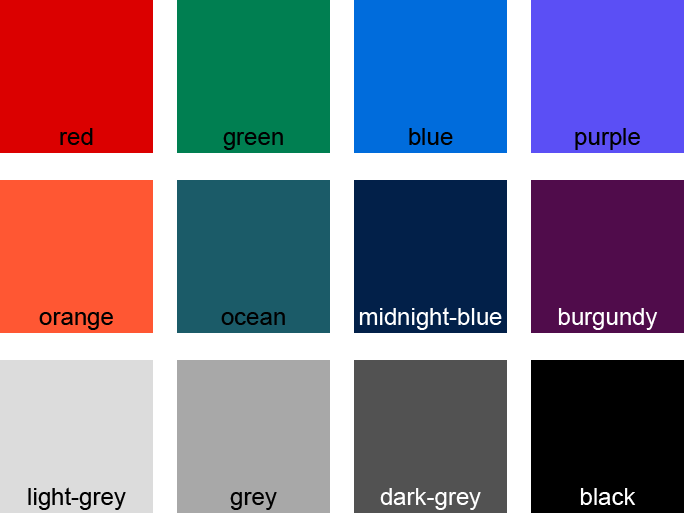

# Custom CSS for Kontent.ai integrations

## Overview

The SCSS file defines classes for elements commonly used when developing a custom element or an open source tool that seeks to maintain Kontent.ai visual identity, such as inputs, buttons, etc. It also comes with predefined color classes, using a palette from Kontent.ai application interface. The color classes can be combined with most of the element classes to streamline the styling process.

## Installation

Link or copy the **styles.css** file to your application or copy the SCSS and compile it yourself.

## Colors

There are twelve base colors defined in the CSS, wrapped in a matching number of color classes of the same name (minus the CSS custom property syntax `--`). These are as follows:



You can combine the color classes with most of the elements in the following manner:

```html
<div class="button red">Red button</div>
```

If you want to use any of the colors in your own class, use CSS `var()` function, e.g. `color: var(--red)`.

> [!NOTE]  
> Class names do not correspond to their CSS color counterparts. All colors are custom, matching the Kontent.ai application interface.

## Basic styles

One-class-does-it-all styles with optional modifiers.

### .button

A round, bordered button with a hover animation. Defaults to upper-case font, which can be overridden using `no-caps` helper class.

#### Modifiers

- `secondary`: sets background color to match border color, defaults font color to `white`
- `destructive`: specific style for **Delete** and similar actions, matches UI
- `[color-class-name]`: affects `border-color` and `background-color ::hovered`, `background-color` for secondary only
- `no-caps`: sets `text-transform` to `none`
- `disabled`: sets `opacity` to 0.5 and disables pointer events

#### Usage example
[![Button Click]](https://htmlpreview.github.io/?https://github.com/kontent-ai/stylesheet-generator/blob/main/styles/showcase.html#button)
```html
<div class="button destructive">Delete</div>
<div class="button green">Save</div>
<div class="button secondary">Cancel</div>
```

### .input

Base class for all kinds of inputs, comes in a form of rounded box with hover effect.

#### Modifiers

- `[color-class-name]`: affects `border-color` and its `:hover` state
- `type="text"`: sets placeholder color to light-grey and cursor to `text`
- `disabled`: sets `opacity` to 0.5 and disables pointer events

#### Usage example
[![Button Click]](https://htmlpreview.github.io/?https://github.com/kontent-ai/stylesheet-generator/blob/main/styles/showcase.html#text-input)
```html
<input class="input" placeholder="Insert something" type="text">
```

### .status

A small pill-shaped informative element with optional colored background. Useful e.g. for displaying a loading status of an asynchronously fetched asset.

#### Modifiers

- `[color-class-name]`: affects `border-color`, `background-color` and sets font `color` to `white`

#### Usage example
[![Button Click]](https://htmlpreview.github.io/?https://github.com/kontent-ai/stylesheet-generator/blob/main/styles/showcase.html#status)
```html
<div class="status red">Loading failed.</div>
```

### .section

A bordered area for content, with round corners and predefined padding, suitable for separating UI elements.

#### Modifiers

- `[color-class-name]`: affects `border-color`

#### Usage example
[![Button Click]](https://htmlpreview.github.io/?https://github.com/kontent-ai/stylesheet-generator/blob/main/styles/showcase.html#section)
```html
<div class="section">
    <div>Some text content</div>
    <div class="button">Button</div>
</div>
```

### .section.info

Same as section but with background color set to 10% of border color. Suitable for warning or info boxes.

#### Modifiers

- `[color-class-name]`: affects `border-color`, `background-color`

#### Usage example
[![Button Click]](https://htmlpreview.github.io/?https://github.com/kontent-ai/stylesheet-generator/blob/main/styles/showcase.html#section-info)
```html
<div class="section info red">
    <h2>Warning</h2>
    <p>Some warning message.</p>
</div>
```

### .loader

A simple animation to display if the custom element is busy loading a resource, e.g. from an asynchronous operation.

Apply dynamically and combine with `pointer-events: none` to prevent user interaction.

#### Usage example
[![Button Click]](https://htmlpreview.github.io/?https://github.com/kontent-ai/stylesheet-generator/blob/main/styles/showcase.html#loader)
```html
<div class="loader"></div>
```

#### Modifiers

- `[color-class-name]`: affects the loader colors

## Composed styles

Multiple classes meant to be used together to achieve the desired style.

### Switch

Modified checkbox in form of an animated on/off switch.

#### Classes
- `.switch`, `.slider`

#### Modifiers
- `slider [color-class-name]`: affects color of a toggled switch
- `disabled`: sets `opacity` to 0.5 and disables pointer events

#### Usage example
[![Button Click]](https://htmlpreview.github.io/?https://github.com/kontent-ai/stylesheet-generator/blob/main/styles/showcase.html#switch)
```html
<label class="switch">
    Switch
    <input type="checkbox" id="switch">
    <span class="slider red"></span>
</label>
```

### Checkbox

Animated checkbox in UI colors.

#### Classes
- `.checkbox`, `.checkmark`

#### Modifiers
- `disabled`: sets `opacity` to 0.5 and disables pointer events

#### Usage example
[![Button Click]](https://htmlpreview.github.io/?https://github.com/kontent-ai/stylesheet-generator/blob/main/styles/showcase.html#checkbox-and-radio)
```html
<label class="checkbox">
    <input type="checkbox" id="checkbox">
    <span class="checkmark"></span>
    Expert
</label>
```

### Radio

Animated radio buttons in UI colors.

#### Classes
- `.radio`, `.radio-button`

#### Modifiers
- `disabled`: sets `opacity` to 0.5 and disables pointer events

#### Usage example
[![Button Click]](https://htmlpreview.github.io/?https://github.com/kontent-ai/stylesheet-generator/blob/main/styles/showcase.html#checkbox-and-radio)
```html
<label class="radio">
    <input type="radio" name="radio" checked>
    <span class="radio-button"></span>
    Option 1
</label>

<label class="radio">
    <input type="radio" name="radio">
    <span class="radio-button"></span>
    Option 2
</label>
```

### Dropdown

Input in form of an animated dropdown menu with multiple options.

#### Classes

- `.select`, `.options`, `.option`

#### Modifiers

- `.option.selected`: highlights the currently selected option in the dropdown
- `.select.open`: when the `open` class is set, it applies animated 180 degree rotation to the arrow. Rotates back when the class is removed.
- `disabled`: sets `opacity` to 0.5 and disables pointer events

#### Usage example
[![Button Click]](https://htmlpreview.github.io/?https://github.com/kontent-ai/stylesheet-generator/blob/main/styles/showcase.html#select)
```html
<div class="select">Pick an option</div> 
<div class="options">
    <div class="option">Available option</div>
    <div class="option selected">Selected option</div>
</div>
```

> [!NOTE]  
> Above example doesn't work on its own but expects JavaScript to handle toggle and selection events.
>
> It's possible to use the `select` class with the HTML `<select>` element by removing its default styling and applying the class on a wrapper div.

## Contributing

Clone the repository and adjust the **styles.scss** file accordingly. To test the styles locally, run `npm run convert` to build the **styles.css** file and its map.

<!--[ Buttons ]-->

[Button Click]: https://img.shields.io/badge/See_live-37a779?style=for-the-badge
