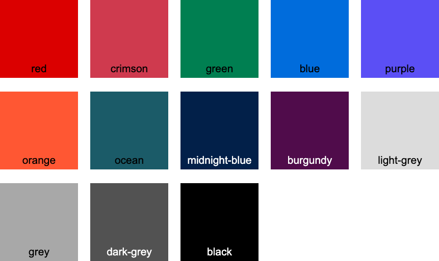

# Custom CSS for Kontent.ai integrations

## Overview

The SCSS/CSS file defines classes for elements commonly used when developing a custom element or an open source tool that seeks to maintain Kontent.ai visual identity, such as inputs, buttons, etc. It also comes with predefined color classes, using a palette from Kontent.ai application interface. The color classes can be combined with most of the element classes to streamline the styling process.

## Installation

Install using your preferred package manager. 
```
npm i @kontent-ai/stylekit
```
If your environment supports it (e.g. you're using a bundler), you can import the styles directly:

```javascript
import '@kontent-ai/stylekit';
```

Alternatively, you can link the CSS from `node_modules`:

```html
<link rel="stylesheet" href="node_modules/@kontent-ai/stylekit/styles/styles.css">
```

### Files

| File | Use it when |
| --- | --- |
| `styles/styles.css` | Default. Plain, unlayered CSS that works everywhere. |
| `styles/styles.layered.css` | You want your own CSS to always win. Same styles, wrapped in `@layer stylekit`. |
| `styles/tailwind.css` | You use Tailwind CSS v4 and want the palette as Tailwind colors. |
| `styles/styles.scss`, `styles/_tokens.scss` | You use Sass and want the source or the palette map. |
| `styles/dropdown.js` | Plain HTML pages that need the [dropdown](#dropdown) to work without a framework. |
| `styles/fonts/` | The bundled Inter font and its license. `styles.css` loads it with a relative URL, so keep the folder next to the CSS. See [Font](#font). |

### Cascade layers

`styles.css` is unlayered, so its classes compete with your CSS on specificity and source order. To make your own CSS always win, use the layered build instead:

```html
<link rel="stylesheet" href="node_modules/@kontent-ai/stylekit/styles/styles.layered.css">
```

You can also put `styles.css` into a layer of your choice: `@import "@kontent-ai/stylekit/styles/styles.css" layer(vendor);`.

> [!WARNING]
> Any unlayered CSS beats layered CSS, even an element selector. If you use the layered build together with a global reset (e.g. Bootstrap's reboot sets `input { font-size: inherit }`), the reset overrides the stylekit. Put the reset in a layer declared before `stylekit`, or use `styles.css`.

### Tailwind CSS (v4)

Import the stylekit into Tailwind's `components` layer, then import the theme file:

```css
@import "tailwindcss";
@import "@kontent-ai/stylekit/styles/styles.css" layer(components);
@import "@kontent-ai/stylekit/styles/tailwind.css";
```

- `layer(components)` puts the stylekit above Tailwind's preflight, which would otherwise reset the padding and borders of `.input` and similar classes, and below the utilities, so `class="button bg-kontent-ocean"` works as expected.
- `tailwind.css` adds every palette color as a `kontent-*` Tailwind color: `bg-kontent-purple`, `text-kontent-red`, `border-kontent-midnight-blue`, … including `kontent-white`. These follow any override of the stylekit custom properties. Without `styles.css` they fall back to the default hex values, so the theme file also works on its own.

The component classes (`.button`, `.input`, …) stay plain CSS; there is no Tailwind plugin.

With the Vite plugin (`@tailwindcss/vite`), the bundled font loads as is. The standalone Tailwind CLI copies `styles.css` into its output without adjusting the font's relative URL, so copy `node_modules/@kontent-ai/stylekit/styles/fonts/` into a `fonts/` folder next to your output CSS.

### Less

Copy the CSS into your output as-is (Less doesn't need to parse it):

```less
@import (inline) "node_modules/@kontent-ai/stylekit/styles/styles.css";
```

### Sass

The SCSS source ships with the package. `@use` the styles to output the CSS, or `@use` only the tokens to get the palette map (`$palette`) and the color map used for the modifiers (`$colors`) without any CSS output:

```scss
@use "sass:map";
@use "pkg:@kontent-ai/stylekit/styles/styles";        // all stylekit CSS
@use "pkg:@kontent-ai/stylekit/styles/tokens" as kai;  // only the variables

.my-thing { border-color: map.get(kai.$palette, "purple"); }
```

The `pkg:` URLs need Sass 1.71+ with the Node.js package importer. Otherwise, add `node_modules` to your load paths and drop the `pkg:` prefix.

## Colors

There are thirteen base colors defined in the CSS, wrapped in a matching number of color classes of the same name (minus the CSS custom property syntax `--`). These are as follows:



You can combine the color classes with most of the elements in the following manner:

```html
<div class="button red">Red button</div>
```

If you want to use any of the colors in your own class, use CSS `var()` function, e.g. `color: var(--kontent-red)`.

Each color is defined as a short custom property (`--red`), which the stylekit classes use, and as a namespaced alias (`--kontent-red`). Use the `--kontent-*` aliases in your own code: they always point to the short names, so overriding `--red` to adjust the stylekit also changes `--kontent-red`, and they are the names that will stay if the short ones are ever removed.

The color classes are `red`, `crimson`, `green`, `blue`, `purple`, `orange`, `ocean`, `midnight-blue`, `burgundy`, `light-grey`, `grey`, `dark-grey` and `black`. A `--white` (`#ffffff`) custom property is also defined for use in your own styles, but there is no `white` color class.

> [!NOTE]  
> Class names do not correspond to their CSS color counterparts. All colors are custom, matching the Kontent.ai application interface.

## Global helpers

- `.disabled`: can be added to any element (button, input, switch, checkbox, radio, dropdown…); sets `opacity` to 0.5 and disables pointer events.
- Font: `html`, `body` and any `.custom-element` wrapper get `font-family: var(--kontent-font-family)`, which is `Inter, sans-serif`. See [Font](#font).

## Font

The Kontent.ai app uses [Inter](https://rsms.me/inter/), and the stylekit ships it: `styles/fonts/InterVariable.woff2`, 56 kB, loaded with `@font-face` and `font-display: swap`. It's Inter 4.1, subset to Latin (including Central European characters, typographic punctuation, currency symbols and arrows), with weights 400 to 700 and the optical size fixed at the text cut. No font is loaded from a third-party CDN.

To use a different font, override the custom property:

```css
:root { --kontent-font-family: "Your Font", sans-serif; }
```

If nothing uses Inter, the browser doesn't download the file.

Inter is © The Inter Project Authors and licensed under the SIL Open Font License 1.1. The license ships in `styles/fonts/Inter-LICENSE.txt`; keep it with the font file if you copy the file elsewhere.

## Basic styles

One-class-does-it-all styles with optional modifiers.

### .button

A round, color-filled button with a hover animation. Defaults to upper-case font, which can be overridden using `no-caps` helper class.

#### Modifiers

- `secondary`: bordered button, sets background color to `white`, defaults font color to `black`
- `destructive`: specific style for **Delete** and similar actions, matches UI
- `[color-class-name]`: affects `border-color` and `background-color ::hovered`, `background-color` for secondary only
- `no-caps`: sets `text-transform` to `none`
- `disabled`: sets `opacity` to 0.5 and disables pointer events

#### Usage example
[![Button Click]](https://htmlpreview.github.io/?https://github.com/kontent-ai/stylesheet-generator/blob/main/styles/showcase.html#button)
```html
<div class="button destructive">Delete</div>
<div class="button green">Save</div>
<div class="button secondary">Cancel</div>
```

> [!TIP]
> Buttons follow their UI hierarchy. Default (primary) button is filled, secondary button is bordered. 
>
> `destructive` is a standalone style and shouldn't be combined with `secondary` modifier.

### .input

Base class for all kinds of inputs, comes in a form of rounded box with hover effect.

#### Modifiers

- `[color-class-name]`: affects `border-color` and its `:hover` state
- `type="text"`: sets cursor to `text`
- `aria-invalid="true"` or `invalid`: red border, darker red on hover and focus. Also works on `.select`, and wins over color modifiers. See [Caption and invalid state](#input-caption-and-invalid-state).
- `disabled`: sets `opacity` to 0.5 and disables pointer events

#### Usage example
[![Button Click]](https://htmlpreview.github.io/?https://github.com/kontent-ai/stylesheet-generator/blob/main/styles/showcase.html#text-input)
```html
<input class="input" placeholder="Insert something" type="text">
```

### .input-caption and invalid state

A short helper or validation message under an `.input` or `.select`, 8px below it. Put it right after the input (after `.options` for a dropdown).

#### Modifiers

- `invalid`: red text with a warning icon, for validation errors

#### Usage example
[![Button Click]](https://htmlpreview.github.io/?https://github.com/kontent-ai/stylesheet-generator/blob/main/styles/showcase.html#invalid-input)
```html
<input class="input" type="text" aria-describedby="codename-caption">
<span class="input-caption" id="codename-caption">Lowercase letters and underscores only.</span>

<input class="input" type="text" aria-invalid="true" aria-describedby="slug-error">
<span class="input-caption invalid" id="slug-error">Enter a URL slug without spaces.</span>
```

To mark a field invalid, set `aria-invalid="true"` on the input and show an `.input-caption.invalid` that the input points to with `aria-describedby`. Screen readers then announce the field as invalid and read the message. The `invalid` class on the input gives the same look but tells assistive technology nothing, so prefer the attribute. Remove both once the value is valid.

In React: `<input className="input" aria-invalid={!!error} aria-describedby={error ? errorId : undefined} />`, followed by `{error && <span className="input-caption invalid" id={errorId}>{error}</span>}`.

The stylekit doesn't style the browser's built-in `:invalid` / `:user-invalid` states, so fields with `required` or `pattern` don't turn red until you set `aria-invalid`.

### .status

A small pill-shaped informative element with optional colored background. Useful e.g. for displaying a loading status of an asynchronously fetched asset.

#### Modifiers

- `[color-class-name]`: affects `border-color`, `background-color` and sets font `color` to `white`

#### Usage example
[![Button Click]](https://htmlpreview.github.io/?https://github.com/kontent-ai/stylesheet-generator/blob/main/styles/showcase.html#status)
```html
<div class="status red">Loading failed.</div>
```

### .section

A bordered area for content, with round corners and predefined padding, suitable for separating UI elements.

#### Modifiers

- `[color-class-name]`: affects `border-color`

#### Usage example
[![Button Click]](https://htmlpreview.github.io/?https://github.com/kontent-ai/stylesheet-generator/blob/main/styles/showcase.html#section)
```html
<div class="section">
    <div>Some text content</div>
    <div class="button">Button</div>
</div>
```

### .section.info

Same as section but with background color set to 10% of border color. Suitable for warning or info boxes.

#### Modifiers

- `[color-class-name]`: affects `border-color`, `background-color`

#### Usage example
[![Button Click]](https://htmlpreview.github.io/?https://github.com/kontent-ai/stylesheet-generator/blob/main/styles/showcase.html#section-info)
```html
<div class="section info red">
    <h2>Warning</h2>
    <p>Some warning message.</p>
</div>
```

### .loader

A simple animation to display if the custom element is busy loading a resource, e.g. from an asynchronous operation.

Apply dynamically and combine with `pointer-events: none` to prevent user interaction.

#### Usage example
[![Button Click]](https://htmlpreview.github.io/?https://github.com/kontent-ai/stylesheet-generator/blob/main/styles/showcase.html#loader)
```html
<div class="loader"></div>
```

#### Modifiers

- `[color-class-name]`: affects the loader colors

## Composed styles

Multiple classes meant to be used together to achieve the desired style.

### Switch

Modified checkbox in form of an animated on/off switch.

Markup: a `<label class="switch">` that contains the `<input type="checkbox">`, immediately followed by a `<span class="slider">`. The text label can go before the input. The input must come before `.slider` because the styles use the `input:checked ~ .slider` sibling selector.

#### Classes
- `.switch`, `.slider`

#### Modifiers
- `slider [color-class-name]`: affects color of a toggled switch
- `disabled`: sets `opacity` to 0.5 and disables pointer events

#### Usage example
[![Button Click]](https://htmlpreview.github.io/?https://github.com/kontent-ai/stylesheet-generator/blob/main/styles/showcase.html#switch)
```html
<label class="switch">
    Switch
    <input type="checkbox">
    <span class="slider red"></span>
</label>
```

### Checkbox

Animated checkbox in UI colors.

Markup: a `<label class="checkbox">` that contains the `<input type="checkbox">`, immediately followed by a `<span class="checkmark">`, then the label text.

#### Classes
- `.checkbox`, `.checkmark`

#### Modifiers
- `disabled`: sets `opacity` to 0.5 and disables pointer events

#### Usage example
[![Button Click]](https://htmlpreview.github.io/?https://github.com/kontent-ai/stylesheet-generator/blob/main/styles/showcase.html#checkbox-and-radio)
```html
<label class="checkbox">
    <input type="checkbox">
    <span class="checkmark"></span>
    Expert
</label>
```

### Radio

Animated radio buttons in UI colors.

Markup: a `<label class="radio">` that contains the `<input type="radio">`, immediately followed by a `<span class="radio-button">`, then the label text. Give radios in the same group the same `name`.

#### Classes
- `.radio`, `.radio-button`

#### Modifiers
- `disabled`: sets `opacity` to 0.5 and disables pointer events

#### Usage example
[![Button Click]](https://htmlpreview.github.io/?https://github.com/kontent-ai/stylesheet-generator/blob/main/styles/showcase.html#checkbox-and-radio)
```html
<label class="radio">
    <input type="radio" name="radio" checked>
    <span class="radio-button"></span>
    Option 1
</label>

<label class="radio">
    <input type="radio" name="radio">
    <span class="radio-button"></span>
    Option 2
</label>
```

### Dropdown

Input in form of an animated dropdown menu with multiple options. The stylekit gives you the CSS only, so **your code has to handle the state** (open/closed, the picked option) and the keyboard. Pick one of these:

- **React, Next.js or another framework:** manage the state in your component and render the classes described in [the contract](#dropdown-contract). The [React + TypeScript example](#react--typescript-example) works if you copy it as is.
- **Plain HTML without a framework:** use the [vanilla helper](#vanilla-helper-plain-html) that ships with the package.
- **No custom list needed:** put the `select` class on a native `<select>` element. Its default styling is removed by `appearance: none`, so no JavaScript is needed, but the options list is drawn by the browser.

#### Classes

- `.select`, `.options`, `.option`

#### Modifiers

- `.select.open`: rotates the arrow 180 degrees, with an animation. Set it while the list is open.
- `.option.selected`: highlights the picked option.
- `[color-class-name]` on `.select`: affects `border-color` and its `:hover` state
- `disabled`: sets `opacity` to 0.5 and disables pointer events

#### Usage example
[![Button Click]](https://htmlpreview.github.io/?https://github.com/kontent-ai/stylesheet-generator/blob/main/styles/showcase.html#select)
```html
<div class="select">Pick an option</div>
<div class="options">
    <div class="option">Available option</div>
    <div class="option selected">Selected option</div>
</div>
```

#### Dropdown contract

CSS can't open or close the list. Whatever implementation you use has to produce this markup and behavior:

| Element | Always | When open | When selected / disabled |
| --- | --- | --- | --- |
| `.select` | `role="combobox"`, `aria-haspopup="listbox"`, `aria-controls="<options id>"`, `tabindex="0"`, `aria-expanded` | add `open` class, `aria-expanded="true"` | disabled: add `disabled` class, `aria-disabled="true"`, `tabindex="-1"` |
| `.options` | `role="listbox"`, an `id`; hidden while closed (the `hidden` attribute or not rendering it) | visible | — |
| `.option` | `role="option"`, `tabindex="-1"`, `aria-selected` | — | picked: add `selected` class, `aria-selected="true"` |

`.options` doesn't have to come directly after `.select`, and has no positioning of its own. It sits in the normal document flow, so it pushes the content below it down.

Keyboard and mouse:

- On `.select`: a click toggles the list. Enter, Space, ArrowDown or ArrowUp opens it and moves focus to the selected option, or the first one.
- In the list: ArrowDown / ArrowUp / Home / End move focus. Enter, Space or a click picks the option, closes the list and puts focus back on `.select`. Escape closes the list without picking and puts focus back on `.select`. Tab closes the list.
- A pointer down outside both `.select` and `.options` closes the list.
- An option with keyboard focus gets the same highlight as on hover, through `:focus-visible`.

#### React + TypeScript example

A controlled component that follows the contract. It has no dependencies besides React, and works with React 18 and 19, including the Next.js App Router.

```tsx
'use client'; // Next.js App Router only; harmless elsewhere

import { useEffect, useId, useRef, useState, type KeyboardEvent } from 'react';

export type DropdownOption = { value: string; label: string };

type DropdownProps = {
  options: ReadonlyArray<DropdownOption>;
  value: string | null;
  onChange: (value: string) => void;
  placeholder?: string;
  disabled?: boolean;
  color?: string; // any stylekit color class, e.g. "ocean"
};

export const Dropdown = ({ options, value, onChange, placeholder = 'Pick an option', disabled = false, color }: DropdownProps) => {
  const [isOpen, setIsOpen] = useState(false);
  const rootRef = useRef<HTMLDivElement>(null);
  const selectRef = useRef<HTMLDivElement>(null);
  const optionRefs = useRef<Array<HTMLDivElement | null>>([]);
  const listId = useId();

  const selectedIndex = options.findIndex((option) => option.value === value);

  useEffect(() => {
    if (!isOpen) {
      return;
    }
    optionRefs.current[Math.max(selectedIndex, 0)]?.focus();

    const closeOnOutsidePointer = (event: PointerEvent) => {
      if (!rootRef.current?.contains(event.target as Node)) {
        setIsOpen(false);
      }
    };
    document.addEventListener('pointerdown', closeOnOutsidePointer, true);
    return () => document.removeEventListener('pointerdown', closeOnOutsidePointer, true);
  }, [isOpen, selectedIndex]);

  const close = () => {
    setIsOpen(false);
    selectRef.current?.focus();
  };

  const choose = (option: DropdownOption) => {
    onChange(option.value);
    close();
  };

  const onSelectKeyDown = (event: KeyboardEvent<HTMLDivElement>) => {
    if (['Enter', ' ', 'ArrowDown', 'ArrowUp'].includes(event.key)) {
      event.preventDefault();
      setIsOpen(true);
    }
  };

  const onOptionKeyDown = (event: KeyboardEvent<HTMLDivElement>, index: number) => {
    const focusAt = (i: number) => optionRefs.current[Math.min(Math.max(i, 0), options.length - 1)]?.focus();
    switch (event.key) {
      case 'ArrowDown': event.preventDefault(); focusAt(index + 1); break;
      case 'ArrowUp': event.preventDefault(); focusAt(index - 1); break;
      case 'Home': event.preventDefault(); focusAt(0); break;
      case 'End': event.preventDefault(); focusAt(options.length - 1); break;
      case 'Enter':
      case ' ': event.preventDefault(); choose(options[index]); break;
      case 'Escape': event.preventDefault(); close(); break;
      case 'Tab': setIsOpen(false); break;
    }
  };

  const selectClassName = ['select', color, isOpen && 'open', disabled && 'disabled'].filter(Boolean).join(' ');

  return (
    <div ref={rootRef}>
      <div
        ref={selectRef}
        className={selectClassName}
        role="combobox"
        tabIndex={disabled ? -1 : 0}
        aria-haspopup="listbox"
        aria-expanded={isOpen}
        aria-controls={listId}
        aria-disabled={disabled || undefined}
        onClick={() => (isOpen ? close() : !disabled && setIsOpen(true))}
        onKeyDown={onSelectKeyDown}
      >
        {options[selectedIndex]?.label ?? placeholder}
      </div>
      <div id={listId} className="options" role="listbox" hidden={!isOpen}>
        {options.map((option, index) => (
          <div
            key={option.value}
            ref={(element) => { optionRefs.current[index] = element; }}
            className={option.value === value ? 'option selected' : 'option'}
            role="option"
            aria-selected={option.value === value}
            tabIndex={-1}
            onClick={() => choose(option)}
            onKeyDown={(event) => onOptionKeyDown(event, index)}
          >
            {option.label}
          </div>
        ))}
      </div>
    </div>
  );
};
```

```tsx
const [car, setCar] = useState<string | null>(null);

<Dropdown
  options={[{ value: 'volvo', label: 'Volvo' }, { value: 'skoda', label: 'Skoda' }]}
  value={car}
  onChange={setCar}
  placeholder="Choose your car"
/>
```

#### Vanilla helper (plain HTML)

For pages that don't use a framework, the package ships `styles/dropdown.js`. It's a small helper with no dependencies that sets up the contract above on existing markup.

```html
<script src="node_modules/@kontent-ai/stylekit/styles/dropdown.js"></script>
<script>
    StylekitDropdown.initDropdowns();
</script>
```

- `StylekitDropdown.initDropdowns(root = document)` sets up every `.select` that is immediately followed by an `.options` element, or that points to one with `aria-controls`. `StylekitDropdown.initDropdown(select, options?)` sets up a single dropdown. Both are safe to call more than once and return `{ open(), close(), destroy() }` handles.
- Picking an option replaces the text of `.select` with the option's text, and fires a bubbling `change` event on `.select` with `event.detail = { value, option }`. `value` is the option's `data-value` attribute, or its text if there is none.

> [!WARNING]
> Don't use `dropdown.js` on markup that React (or Vue, Svelte, …) renders. The helper changes classes and text nodes directly, which conflicts with the framework's own rendering. Use the contract and the component example above instead. The helper has no TypeScript types.

## Contributing

Clone the repository and adjust the **styles.scss** file accordingly. The palette lives in **_tokens.scss**: change it there and the custom properties, the `--kontent-*` aliases, the color classes and the Tailwind theme all follow. To test the styles locally, run `npm run build`. This builds **styles.css** (with its map), **styles.layered.css** and **tailwind.css**, and copies the fresh CSS and **dropdown.js** inline into **showcase.html**, between the `stylekit:css` / `stylekit:js` markers. Commit the updated **showcase.html**; **styles.css** is only published to npm.

## Changelog

### 1.1.0

- Defined `--crimson` as `#cf3a4e`, the Kontent.ai brand's primary red. The `crimson` modifiers existed in 1.0.0 but referenced an undefined property, so they produced invalid CSS; they now work.
- Defined `--white`, so `.button.secondary` now gets the white background it was documented to have.
- Added `styles/styles.layered.css`: the same styles inside `@layer stylekit`, so your own CSS always wins. The default `styles.css` is unchanged and stays unlayered.
- Added namespaced `--kontent-*` aliases for every color custom property.
- Added `styles/tailwind.css`, a Tailwind CSS v4 theme with the palette as `kontent-*` colors, plus instructions for using the stylekit with Tailwind, Less and Sass.
- Moved the palette to `styles/_tokens.scss`, the single source for the custom properties, color classes and Tailwind theme.
- Switched the font from `sans-serif` to Inter, the Kontent.ai app's font, bundled with the package (56 kB Latin subset, SIL Open Font License 1.1). Override it with `--kontent-font-family`.
- Added an invalid state for `.input` and `.select` (`aria-invalid="true"` or `invalid`) and `.input-caption` / `.input-caption.invalid` for helper and error messages, matching the app's input alert state.
- Documented the dropdown contract (classes, ARIA, keyboard) and added a React + TypeScript example component.
- Added `styles/dropdown.js`, an accessible dropdown helper for plain HTML (keyboard, click outside to close, ARIA), and a focus style for keyboard-highlighted options.
- Showcase: unique ids, the dropdown now uses the helper, and its CSS is regenerated on every build.
- README: documented the global helpers, the exact switch/checkbox/radio markup and the dropdown helper.

<!--[ Buttons ]-->

[Button Click]: https://img.shields.io/badge/See_live-37a779?style=for-the-badge
